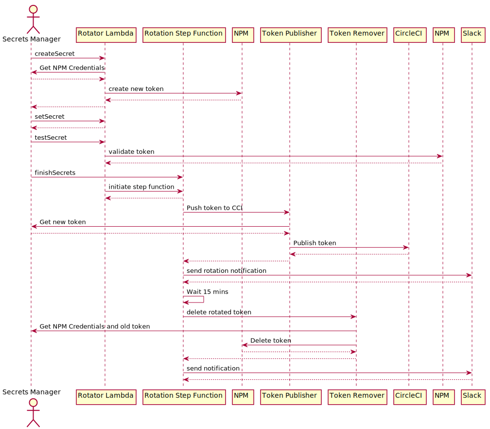

# NPM Token rotation (GitHub Actions)

This is a project that generates CDK stacks to rotate the NPM tokens. The stack is generated based on the configuration passed in `config.json` file in the root of the project. The configuration should have the following shape

#### Configuring the app

The `config.json` configuration file should be populated with the
information about **accessing** secret values from AWS Secrets Manager. **It must not be
used to store the secret values themselves.**

### Configuring GitHub

After NPM tokens are rotated, CDK will update the GitHub secrets with the new rotated token. This CDK works with both environment and repository secrets. Organization secrets are not supported.

Please see [Encrypted Secrets](https://docs.github.com/en/actions/security-guides/encrypted-secrets) documentation to learn more.
## Sample `config.json`

```json
{
  "npmLoginUsernameSecret": {
    "arn": "arn:aws:secretsmanager:us-east-2:12345678:secret:npm-username-secret-ui4F2W",
    "secretKey": "npm_login_username",
    "roleArn":"arn:aws:iam::21111111111:role/npm-token-rotation-role"
  },
  "npmLoginPasswordSecret": {
    "arn": "arn:aws:secretsmanager:us-east-2:12345678:secret:npm-password-secret-OauC99",
    "secretKey": "npm_login_password",
    "roleArn":"arn:aws:iam::21111111111:role/npm-token-rotation-role"
  },
  "npmOtpSeedSecret": {
    "arn": "arn:aws:secretsmanager:us-east-2:12345678:secret:npm-otp-secret-WUwjkx",
    "secretKey": "npm_otp_seed",
    "roleArn":"arn:aws:iam::21111111111:role/npm-token-rotation-role"
  },
  "npmAccessTokenSecrets": {
    "secrets": [
      {
        "arn": "arn:aws:secretsmanager:us-east-2:12345678:secret:npm_access_token_secrets_cli-ZtI1lL",
        "secretKey": "npm_access_token",
        "publishConfig": {
          /** Type of GitHub secret. This can be either "Repository" or "Environment" */
          "type": "Environment", 
          /** The name of the environment that stores NPM_TOKEN. Only required if type is "Environment" */
          "environmentName": "publish",
          /** The name of the repository that stores NPM_TOKEN */
          "repository": "aws-amplify/my-repository",
          /** Name of the secret */
          "variableName": "NPM_TOKEN",
          "githubToken": {
            "arn": "arn:aws:secretsmanager:us-east-2:12345678:secret:amplify_ui_github_token-cawIdq",
            "secretKey": "token"
          }
        },
        "slackWebHookConfig": {
          // optional
          "arn": " arn:aws:secretsmanager:us-east-2:1223333:secret:slackWebHookUrl-mCFi2K",
          "secretKey": "url"
        }
      },
      {
        "arn": "arn:aws:secretsmanager:us-east-2:12345678:secret:npm_access_token_secrets_js-ZtI1lL",
        "secretKey": "npm_access_token",
        "publishConfig": {
          "type": "Repository",
          "repository": "aws-amplify/my-repository",
          "variableName": "NPM_PUBLISH_TOKEN",
          "githubToken": {
            "arn": "arn:aws:secretsmanager:us-east-2:12345678:secret:amplify_ui_github_token-cawIdq",
            "secretKey": "token"
          }
        },
        "slackWebHookConfig": {
          // optional
          "arn": " arn:aws:secretsmanager:us-east-2:1223333:secret:slackWebHookUrl-mCFi2K",
          "secretKey": "url"
        }
      }
    ],
    "alarmSubscriptions": ["user@domain.com"]
  }
}
```

Since, CDK does not support creating/populating the secrets, recommended best practice is
to use the AWS CLI or Console to create the above secrets.
For example, to create a secret to hold the npm username using CLI:

```shell
aws secretsmanager create-secret --name npm-username-secret --secret-string "{ \"npm_login_username\": \"my-npm-username\" }"
```

Paste the `ARN` returned from above operation under `npmLoginUsernameSecret`. The `secretKey` (`npm_login_username` in the example) which can be customized. Each of the secret has `secretKey` which indicates the key used to store secrets in SecretManager. The `npmLoginUsernameSecret`, `npmLoginPasswordSecret` and `npmOtpSeedSecret` accept optional `roleArn` to support retrieving the credentials from a different account as the NPM credentials can be shared between different teams. 

| Configuration Key                                                | Description                                                                                          |
| ---------------------------------------------------------------- | ---------------------------------------------------------------------------------------------------- |
| npmLoginUsernameSecret                                           | NPM Login name `arn`, `secretKey` and optional `roleArn`                                             |
| npmLoginPasswordSecret                                           | NPM Login password `arn`, `secretKey` and optional `roleArn`                                         |
| npmOtpSeedSecret                                                 | TOTP Seed `arn`, `secretKey` and optional `roleArn`                                                  |
| npmAccessTokenSecrets.secrets                                    | List of tokens that needs rotation                                                                   |
| npmAccessTokenSecrets.secrets[].arn                              | ARN of NPM token that needs rotation                                                                 |
| npmAccessTokenSecrets.secrets[].secretKey                        | Secret Key                                                                                           |
| npmAccessTokenSecrets.secrets[].publishConfig.type               | Location where GitHub secret gets stored. This could either be Context or Environment                |
| npmAccessTokenSecrets.secrets[].publishConfig.environmentName    | Name of GitHub environment context when type is Environment                                          |
| npmAccessTokenSecrets.secrets[].publishConfig.repository         | The name of the repository                                                                           |
| npmAccessTokenSecrets.secrets[].publishConfig.secretName         | Name of the secret containing NPM_TOKEN                                                              |
| npmAccessTokenSecrets.secrets[].publishConfig.githubToken        | GitHub Token secret `arn`, `secretKey` and optional `roleArn`                                      |
| npmAccessTokenSecrets.secrets[].publishConfig.slackWebHookConfig | [Optional] `arn`, `secretKey` and optional `roleArn` for slackWebhookUrl used for notification       |

## High Level Architecture


The CDK stack adds a secret rotation lambda function which would trigger automatic rotation of Configured NPM Token. When the automatic rotation [lambda function](src/lambda/create-new-token/index.ts) is triggered which requests creation of new NPM token using the credentials provided in the `config.json` and triggers Step Function to which [pushes the credentials to CircleCI](src/lambda/step-01-publish-token/index.ts) and after 15 minutes of wait it [deletes the old tokens](src/lambda/step-02-delete-old-token/index.ts).




If any of the credentials are stored in cross account SecretsManager, the scretes should be configured provide cross account retrieving of secret value by creating a role with trust relationship.
## Useful commands

- `npm run build` compile typescript to js
- `npm run watch` watch for changes and compile
- `npm run test` perform the jest unit tests
- `cdk deploy` deploy this stack to your default AWS account/region
- `cdk diff` compare deployed stack with current state
- `cdk synth` emits the synthesized CloudFormation template
